# ArtHub

## Descripción

ArtHub es una emocionante plataforma web que reúne a artistas, diseñadores, ilustradores y amantes del arte para compartir, descubrir y conectar a través de diversas obras creativas. Ofrecemos un espacio donde la expresión artística florece, facilitando la exhibición de obras y la interacción entre la comunidad artística global.

## Objetivos

- Crear una plataforma inclusiva para artistas de diferentes empresas.
- Fomentar la interacción y descubrimiento de arte entre usuarios registrados.
- Proporcionar a los artistas un medio para promover sus obras y conectarse con otros apasionados del arte.

## Estructura

### Registro de Usuarios

Durante el proceso de registro, los usuarios proporcionan información básica como correo electrónico y contraseña. Esta información se almacena de forma segura en nuestra base de datos.

### Inicio de Sesión

Los usuarios registrados inician sesión utilizando su correo electrónico y contraseña.

### Página Principal

Los visitantes encuentran una selección cautivadora de obras de varios artistas destacados. Al hacer clic en una obra, se accede a una página detallada que muestra información sobre el creador, descripción, likes y la empresa a la que pertenecen.

### Perfil de Usuario

Después de iniciar sesión, los usuarios acceden a su perfil personal, donde pueden:

- Ver y editar su información de perfil.
- Explorar su colección de obras de arte.
- Agregar o eliminar obras.

### Cargar Obras de Arte

Los usuarios tienen la capacidad de cargar sus obras, proporcionando detalles como título, descripción, categoría y seleccionando una imagen de la obra. Una vez cargada, la obra se exhibe en su perfil y en la página principal junto con otras creaciones.

Únete a ArtHub y sumérgete en un mundo vibrante de creatividad, exploración artística y conexiones significativas. ¡Inspírate y sé parte de nuestra comunidad artística en constante crecimiento! 🎨✨
Inicio de la página:
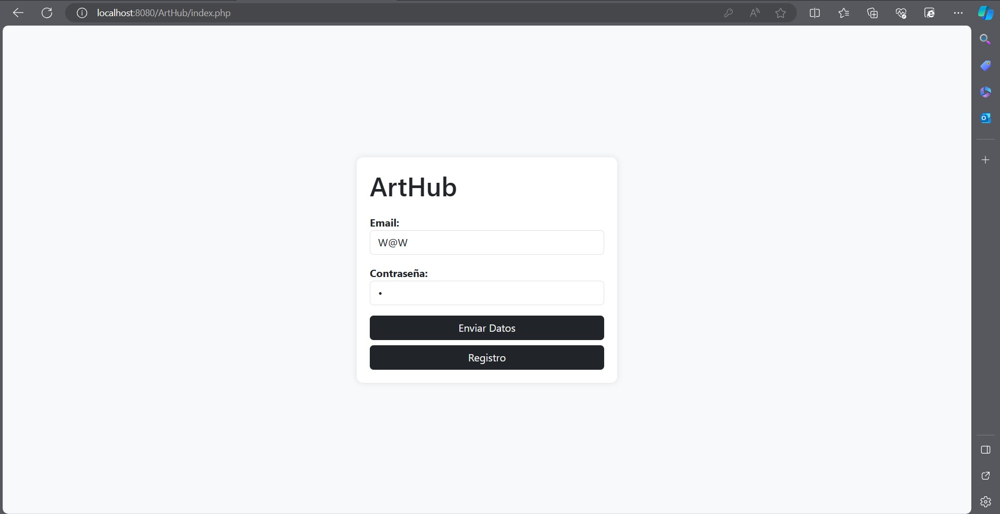
Registro de usuario:
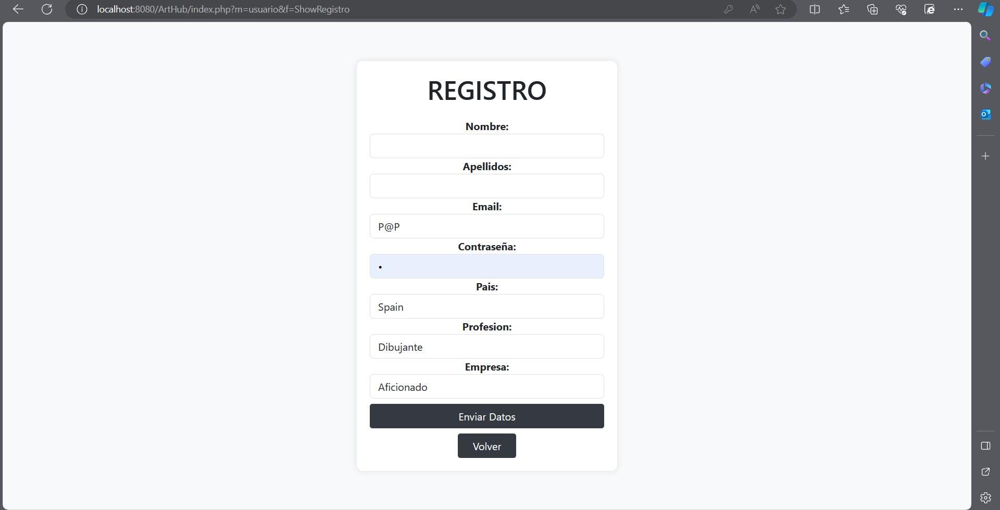
Control de registro:
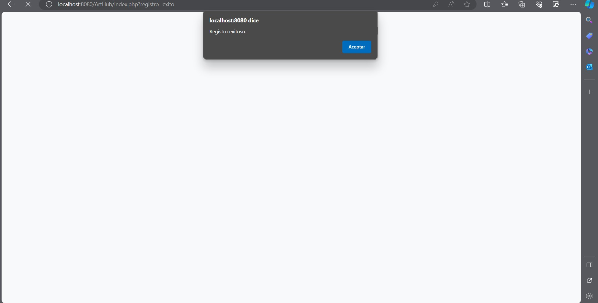
Inicio de sesion: 
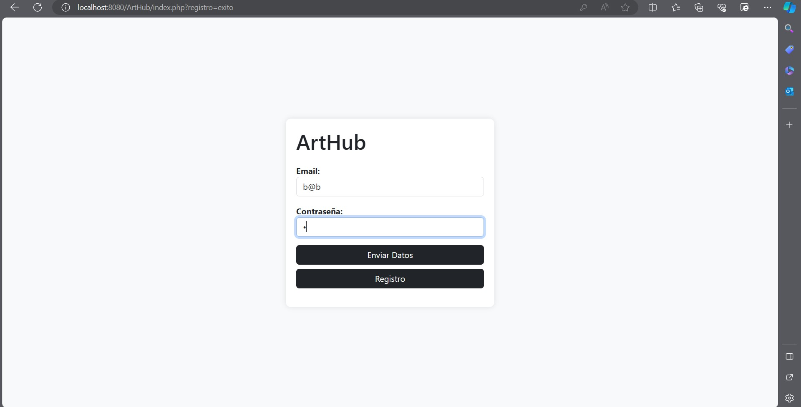
Página principal:
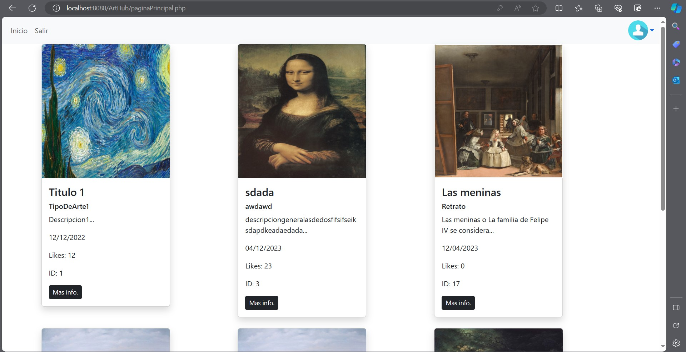
Información de Arte:
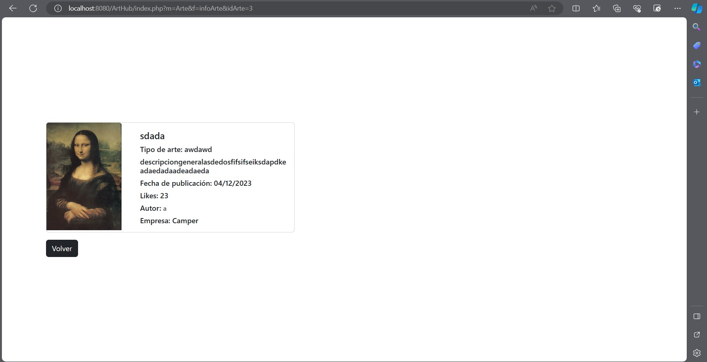
Perfil de Usuario:
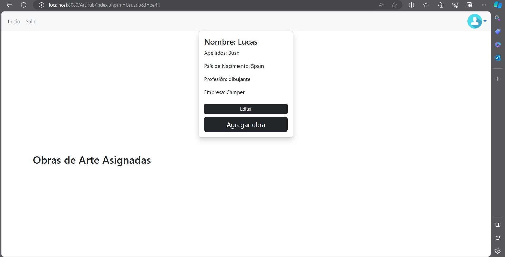
Subir Obra:
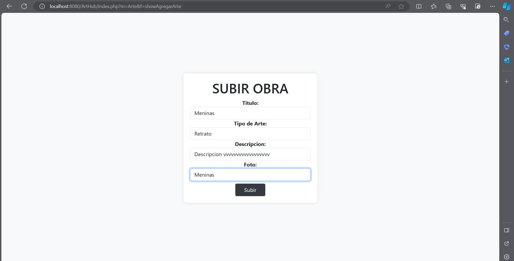
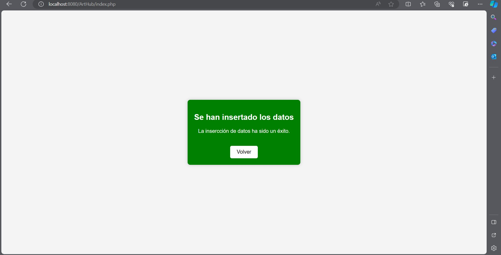
Obra en perfil:
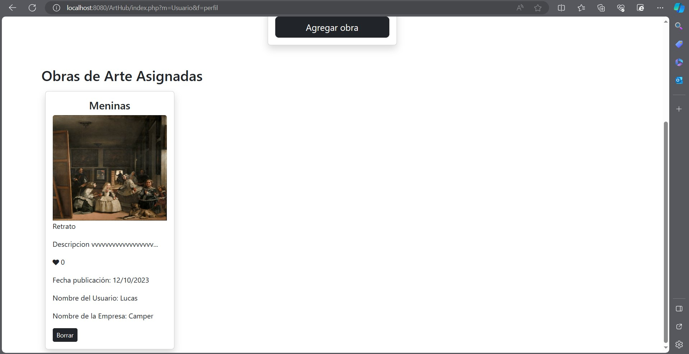
Control Obra cuando se sube mal:

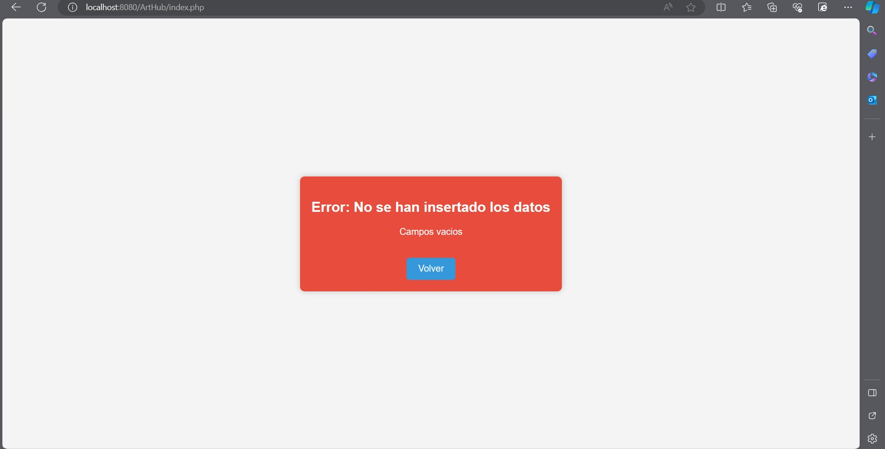
Editar datos usuario:
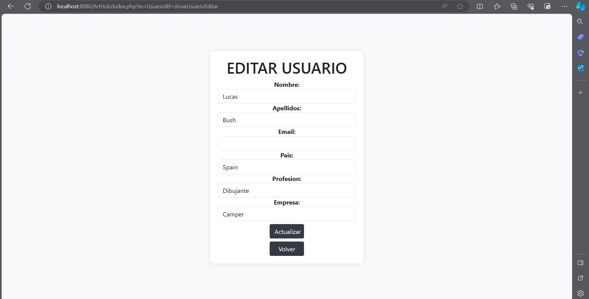
Control edición cuando se sube mal:
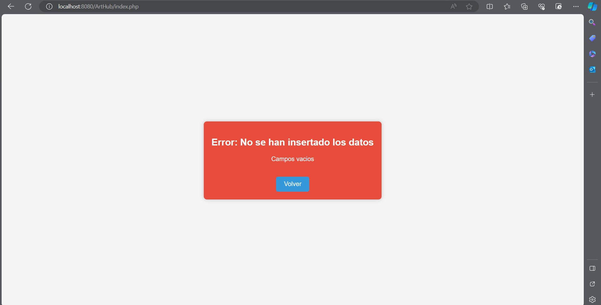
Editar usuario bien:
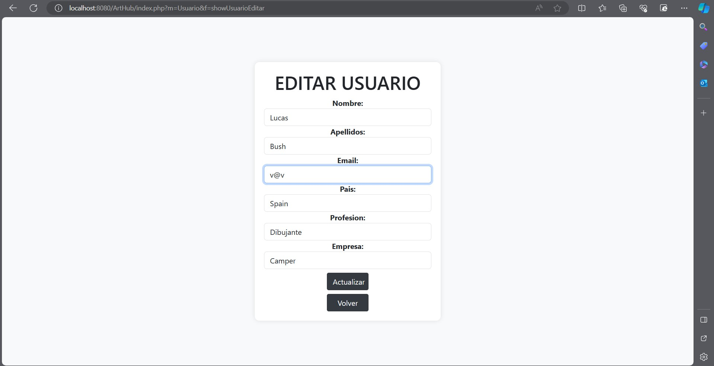

